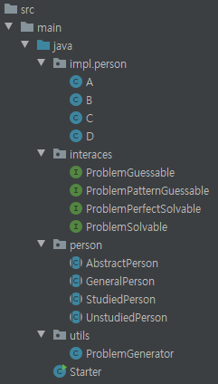
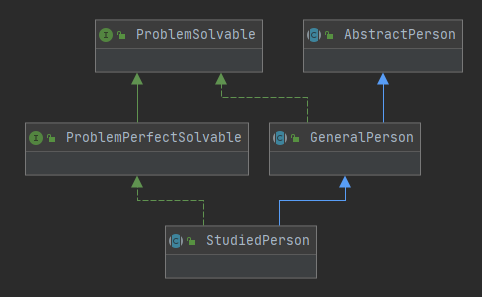
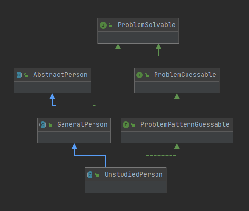

# 문제 2. 찍기 신 - BCSDLab Coding Test
시험장에 A,B,C학생들이 시험을 보러왔다. 하지만 학생들은 공부를 하나도 하지 않고 모든 것을 운에 맡겨서 문제를 풀기로 하였다. 

각각 학생들은 자신만에 찍기 패턴을 가지고 문제를 푼다고 가정을 하였을때 주어진 문제에서 몇 문제를 맞추었는지 출력을 해라

##조건
A,B,C는 Person 클래스를 상속받아서 작성한다

```
A의 찍기 패턴이 1524
B의 찍기 패턴이 134
C의 찍기 패턴이 123454321
```

ex) 문제의 답이 12543341243245321345 라고 가정했을때
```
A가 맞춘 것은 총 4개이다.  
B가 맞춘 것은 총 3개이다.
C가 맞춘 것은 총 5개이다.
```

## 빌드 환경
```
Java Maven Project + Java 9
Entrypoint Class: Starter.java
```

## 구조
> ### 프로젝트 구조
> 
> ### UML - StudiedPerson
> 
> ### UML - UnstudiedPerson
> 

## 실행 결과
```
Test - ExampleProblem
A: 4
B: 3
C: 5
D: 20
Test - GeneratedProblem
A: 3
B: 2
C: 5
D: 20
```